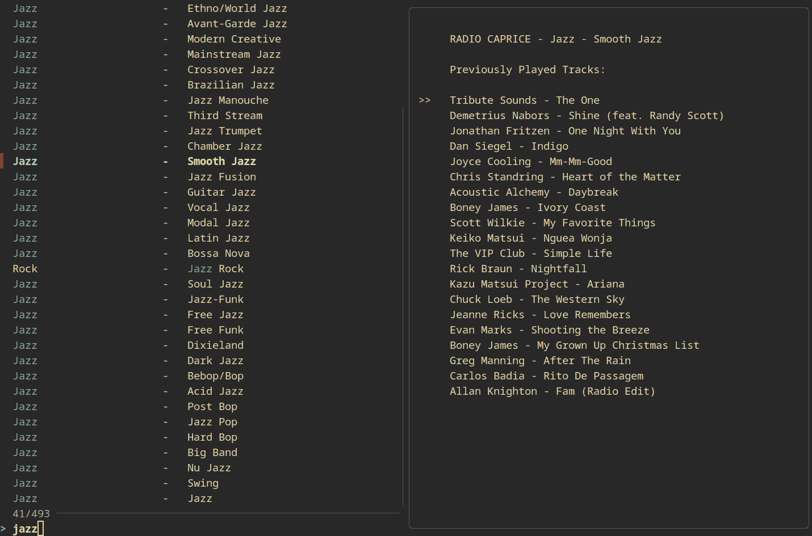
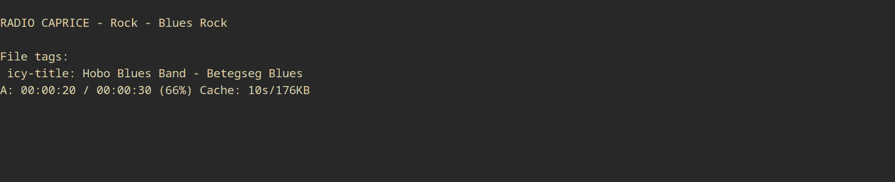

# caprice
## Terminal Frontend for the Caprice Online Radio
 
[Radio Caprice](http://radcap.ru/index-d.html) features over 480 different genres/channels, with this script you can play them all from your terminal.<br>
fzf is used for channel selection and mpv for playback.<br>
The ``radios.json`` database is taken from the Radio Caprice Android App [here](https://m.apkpure.com/de/radio-caprice-online-music/ru.radcap.capriceradio/).


---
### Usage

Call without parameters for the whole genre list:

```
caprice
```

Call with a name to prefilter the channel list:


```
caprice Blues
```

After selecting a channel the audio is automatically played from the terminal using mpv.

---
### Screenshots

**Search Screen**


**Player View**



---
### Installation

Run
```
sudo make install
```

from the main folder.

---
### Customization

Change the ``PLAYER`` and ``FINDER`` variables in the shell script to change the playback and finder tool.

